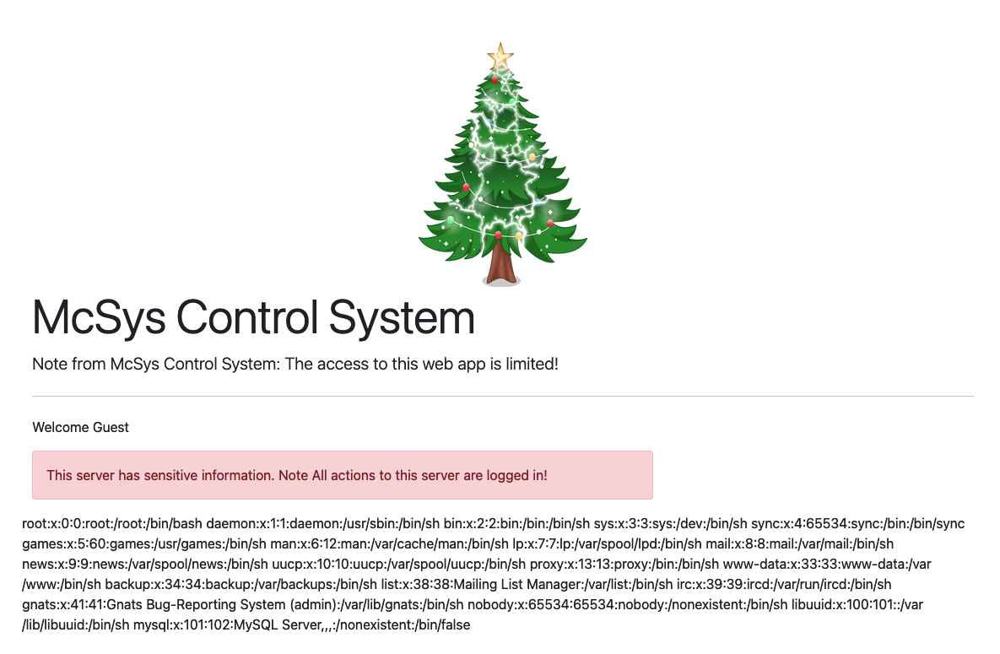

# Web Exploitation: Patch Management is Hard

Author: Corbett Stephens
Date: 12/06/2021

Objective:
Exploring the basics of Local File Inclusion (LFI) and how to identify and test for LFI.

The url `http://10.10.86.193/index.php?err=error.txt` can be used as `http://10.10.86.193/index.php?err=<payload>` to try and find a LFI. This means that the entry point will be the 'err=' parameter. An example would be `http://10.10.86.193/index.php?err=/etc/passwd` which prints out:

Several other methods could be used to produce the same affect such as using '..' to get out of the current directory. The number times '..' will need to be applied is dependent on the file system structure. Filters can be by passed by using '....//'. URL encoding techniques can also be used.

TryHackMe provides these examples:
<pre>
http://example.thm.labs/page.php?file=/etc/passwd 
http://example.thm.labs/page.php?file=../../../../../../etc/passwd 
http://example.thm.labs/page.php?file=../../../../../../etc/passwd%00 
http://example.thm.labs/page.php?file=....//....//....//....//etc/passwd 
http://example.thm.labs/page.php?file=%252e%252e%252fetc%252fpasswd
</pre>

For find the flag at '/etc/flag', I was already using the LFI method to get out of the directory. Initially, I did not find a proper response, but the web application gave me an error message saying 'failed to open stream: No such file or directory in
/var/www/html/index.php'. I could see that index.php is three layers deep into sub directories, so I changed my payload to `../../../etc/flag`. By doing this, the flag was printed to the screen. Just using 
`/etc/flag` as the payload has the same affect.

## Exploiting LFI

When dealing with a PHP web application, the PHP-supported Wrappers can be useful in exploiting LFI. PHP filter can be used to display the content of PHP files in other encoding formats such as base64. By changing the payload to 'php://filter/convert.base64-encode/resource=index.php' the source code of index.php will be written to the screen in base64. The text can then be decoded from base64 where it can be easily readable. Encoding the web app response is important, otherwise, an error will be received in which the web server is trying to execute the the PHP code. 

Next, the LFI vulnerability will be used to achieve Remote Code Execution (RCE) via Log files (log poisoning). 

The PHP code of index.php has an include of './includes/creds.php'. By using the same method of retrieving the index.php code, the creds.php information can be written to the screen as well. './includes/creds.php'

Username: `McSkidy`
password: `A0C315Aw3s0m`

After logging in with these credentials, the log files can be found under the log access link. It can be observed that the logs are in the format `user:ip:USER-Agent:Page`

Since the 'USER-Agent' field is the only header that a user can control, then PHP code can be added to get RCE. 

For a POC, `curl -A "This is testing" http://10-10-248-85.p.thmlabs.com/login.php`can be used to check if this idea hold true. Within the log files, it can be observed that changing the USER-Agent will be helpful.

By using `curl -A "<?php phpinfo();?>" http://10-10-248-85.p.thmlabs.com/login.php` the PHP code will be added to the log file. Using what I learned earlier, if a resource is invoked with PHP code without being encoded, then the web server will try to execute the PHP code. If I use the LFI vulnerability to try to access the logs at `./includes/logs/app_access.log`, then the PHP code that was added in the USER-Agent header of the curl command, should be executed. 

Here we can see that the host name of the web server is `Linux lfi-aoc-awesome-59aedca683fff9261263bb084880c965` and that the PHP version it is running is 5.2.17.

By looking at the PHP variables section, it can be observed that requests are saved under `/tmp/sess_COOKIES`. If the the PHP code is injected into the username, it will be stored into the PHP session file. By using the previous methods of invoking code execution the following URL request can be made
`https://10-10-248-85.p.thmlabs.com/login.php?err=/tmp/sess_4vpuj918nrcsricq46h5qbf5k1`

Once again, the system information will be readable from the web server response.

