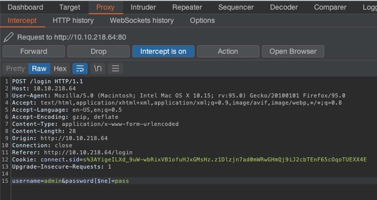
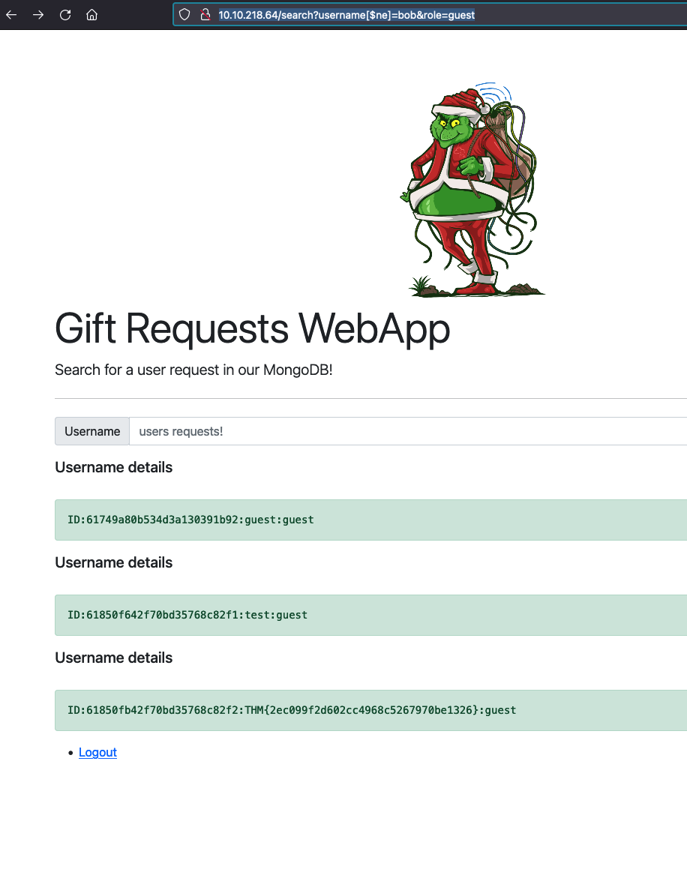
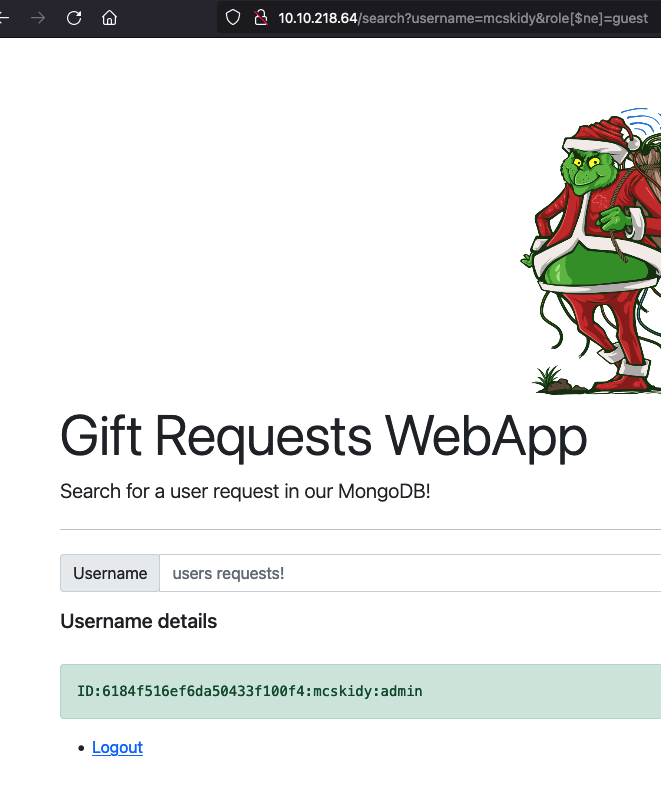

# Web Exploitation: Migration Without Security

Author: Corbett Stephens
Date: 12/21/2021

<ins>Learning Objectives</ins>

1. What is NoSQL?
2. Understanding NoSQL database
3. Understand Why NoSQL happens
4. Understand what NoSQL injection is
5. Using NoSQL Injection to bypass a login form

In MongoDB collections are similar to tables/views, documents are similar to rows/records, and fields are siilar to columns/attributes. Syntax differs in the following way.

<pre>
$and == AND
$or == OR
$eq == =
</pre>

First I used the terminal to login via `ssh thm@10.10.218.64 -p 2222` with credentials thm:tryhackme. Once inside, a mongo shell can be spawned via `mongo`.

The current databases can be viewed with `show databases`.

<pre>
admin   0.000GB
config  0.000GB
flagdb  0.000GB
local   0.000GB
</pre>

The `use` command can be used to connect to an existing database or create a new one.

A new collection is made by doing the following.

<pre>
> use AoC3
switched to db AoC3
> db.createCollection("users")
{ "ok" : 1 }
> db.createCollection("roles")
{ "ok" : 1 }
> db.getCollectionNames();
[ "roles", "users" ]

> db.users.insert({id:"1", username: "admin", email: "admin@thm.labs", password: "idk2021!"})
WriteResult({ "nInserted" : 1 })
> db.users.insert({id:"2", username: "user", email: "user@thm.labs", password: "password1!"})
WriteResult({ "nInserted" : 1 })

> db.users.find()
{ "_id" : ObjectId("61c23080de3cde0b84bc7ab8"), "id" : "1", "username" : "admin", "email" : "admin@thm.labs", "password" : "idk2021!" }
{ "_id" : ObjectId("61c2308bde3cde0b84bc7ab9"), "id" : "2", "username" : "user", "email" : "user@thm.labs", "password" : "password1!" }

> db.users.update({id:"2"}, {$set: {username: "tryhackme"}});
WriteResult({ "nMatched" : 1, "nUpserted" : 0, "nModified" : 1 })
> db.users.find()
{ "_id" : ObjectId("61c23080de3cde0b84bc7ab8"), "id" : "1", "username" : "admin", "email" : "admin@thm.labs", "password" : "idk2021!" }
{ "_id" : ObjectId("61c2308bde3cde0b84bc7ab9"), "id" : "2", "username" : "tryhackme", "email" : "user@thm.labs", "password" : "password1!" }

> db.users.remove({'id':'2'})
WriteResult({ "nRemoved" : 1 })
> db.users.find()
{ "_id" : ObjectId("61c23080de3cde0b84bc7ab8"), "id" : "1", "username" : "admin", "email" : "admin@thm.labs", "password" : "idk2021!" }

> db.users.drop()
true
</pre> 

The next task is to find the flag using the mondo commands that I just learned. First, I switched to the flagdb database. Then, I did the following:

<pre>
> db.getCollectionNames();
[ "flagColl" ]
> db.flagColl.find();
{ "_id" : ObjectId("618806af0afbc09bdf42bd6a"), "flag" : "THM{8814a5e6662a9763f7df23ee59d944f9}" }
>
</pre>

## Bypassing Login Pages!

Fire up Burp Suite. While Burp Suite is loading up try logging in to the web page with admin:pass. This does not work, however, I can use what I just learned about mongo to try to bypass the login. Navigating to the login POST request, it can be changed to be `username=admin&password[$ne]=pass`.

This will essentially create a false postitve which will bypass the login with a noSQL injection. Here the directory 'flag' can be found contaiing the flag for questions two.

The next question asks, "Once you are logged in, use the gift search page to list all usernames that have guest roles. What is the flag"?

This can be done through the URL. I tried to see if 'bob' was in the database and he wasn't. So if I set the parameters as the following, then I should be able to receive a list of username details.

`http://10.10.218.64/search?username[$ne]=bob&role=guest`

The same concept can be used to answer the question, "Use the gift search page to perform NoSQL injection and retrieve the mcskidy record. What is the details record"?

Impicitlly, we know that mcskidy is a valid username, but not a guest because it does not show up in the last query. Therfore, the username can be set to `mcskidy` and the role not equal to `guest`. 

`http://10.10.218.64/search?username=mcskidy&role[$ne]=guest`

