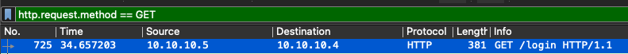
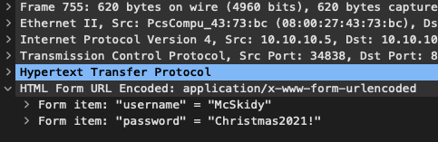
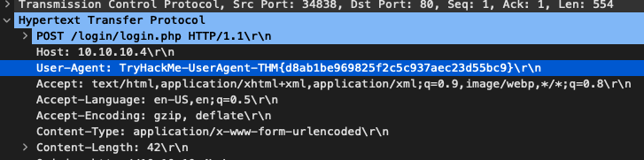
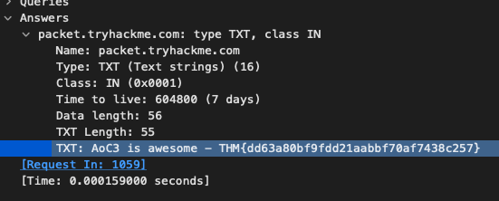
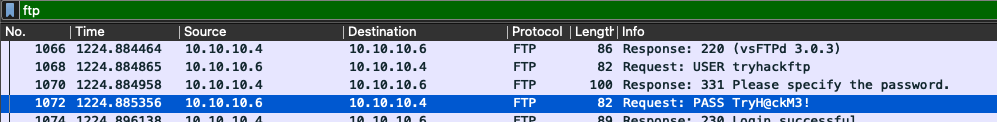

# Networking: Where Is All the Data Going?

Author: Corbett Stephens
Date: 12/23/2021

Objective:
Learn to perform basic packet analysis using Wireshark.

Host `10.10.10.5` \
Server `10.10.10.6`

The first question asks what is the requested directory. To find this, the filter `http.request.method == GET` can be used. The top result will show that `/login` is the requested directory.

The next question asks what is the username and password used in the login page. This would be a POST request. The same methodology can be used to filter by `http.request.method == POST`. Looking at packet number 755, it can be observed that the form username and password is `McSkidy:Christmas2021!`.

The User-Agent name can be found in the HTTP>POST subtree. Here there will be an attribute that says User-Agent. The User-Agent for this POST request is the following: `TryHackMe-UserAgent-THM{d8ab1be969825f2c5c937aec23d55bc9}`

The next question asks for the flag in the message of the TXT DNS query. Rather than searching through all of the DNS queries to find the TXT DNS query, the filter `dns.txt` can be applied. The picture below shows the flag found in the message of this query.

`THM{dd63a80bf9fdd21aabbf70af7438c257}`

The next question asks what is the FTP login password. Again, the `ftp` filter can be applied. Within the filtered packets, there is a request with the status 'PASS' followed by the password `TryH@ckM3`.

